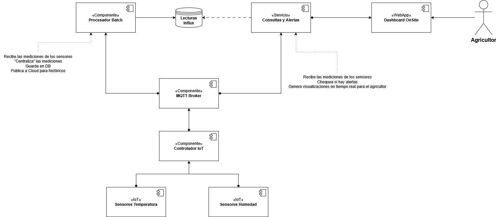

# Agricultural IoT Sensor Simulation & MQTT Publisher

This project simulates temperature and humidity sensor data, publishing it via MQTT. It serves as the data generation component (simulating an "IoT Controller") for the agricultural IoT monitoring system outlined in the architecture below.

Built with Java, Maven, Paho MQTT Client, and designed to integrate with an MQTT broker (like Mosquitto run via Docker).

## Architecture Overview

The target system architecture is as follows:



This module specifically implements the functionality analogous to the `Controlador IoT`, responsible for:
1.  Simulating readings from `Sensores Temperatura` and `Sensores Humedad`.
2.  Publishing these readings to the central `MQTT Broker`.

Downstream components (like `Procesador Batch` and `Servicios Consultas y Alertas`) would subscribe to the broker to consume this data.

## Features

* Simulates random temperature and humidity sensor data.
* Uses configurable sensor details (type, location, ID) within the generator logic.
* Publishes data periodically to a configurable MQTT broker and topic.
* Loads MQTT configuration from a `.env` file for flexibility.
* Includes basic graceful shutdown handling.
* Uses Java Util Logging for log output.

## Prerequisites

Before you begin, ensure you have the following installed:

* **Java Development Kit (JDK):** Version 17 or later (as specified in `pom.xml`).
* **Apache Maven:** Version 3.6+ recommended (for building the project).
* **Docker:** Required for easily running the MQTT broker locally. [Get Docker](https://docs.docker.com/get-docker/)
* **(Optional) MQTT Client Tool:** For monitoring topics, e.g., [MQTT Explorer](https://mqtt-explorer.com/) or `mosquitto_sub`.

## Setup & Running Instructions

Follow these steps to set up the environment and run the simulation:

**1. Clone the Repository**
```bash
  git clone https://github.com/TG-Cannabis/IoT_Component.git
  cd IoT_Component
```

**2. Set up MQTT Broker (Mosquitto via Docker)**

An MQTT broker is required for the application to publish data to. Ensure Docker is running.

First, create a basic `mosquitto.conf` file in the root of the project directory with the following content:
```conf
# mosquitto.conf
listener 1883
allow_anonymous true
```
*Note: This allows anonymous connections for easy setup. Secure your broker with authentication in production.*

Now, run the Mosquitto container using Docker, mounting the configuration file:
```bash
    docker run \
        -p 1883:1883 \
        -p 9001:9001 \
        --name mqtt-broker \
        -v "$(pwd)/mosquitto.conf:/mosquitto/config/mosquitto.conf" \
        -d \
        eclipse-mosquitto
```
You can check if it's running with `docker ps`.

**3. Configure Environment Variables**

The application loads MQTT connection details from a `.env` file. Create a file named `.env` inside the `src/main/resources/` directory:

```dotenv
# src/main/resources/.env

# URL of the MQTT Broker
MQTT_BROKER=tcp://localhost:1883

# Client ID for this publisher instance
MQTT_PUBLISHER_ID=sensor_simulation_client

# Base MQTT topic to publish sensor data to
MQTT_TOPIC=sensors/data
```
Adjust `MQTT_BROKER` if your broker runs elsewhere.

**4. Build the Project**

Use Maven to compile the source code and package it into a JAR file:
```bash
    mvn clean package
```
This command will generate a `.jar` file in the `target/` directory (e.g., `iot_module-1.0-SNAPSHOT.jar`).

**5. Run the Simulation Application**

You can run the data publisher in two ways:

* **Run from the JAR file:**
    ```bash
    java -jar target/iot_module-1.0-SNAPSHOT.jar
    ```
* **Run from your IDE:**
    * Import the project as a Maven project.
    * Locate the `SimulationApp.java` class within the `simulation` package.
    * Run the `main` method.

The application will start connecting to the MQTT broker and publishing simulated sensor data every few seconds to the configured topic. Check the console output for logs.

## Project Structure

```
.
├── image_648cc2.png        # Architecture Diagram
├── mosquitto.conf          # Example broker config for Docker setup
├── pom.xml                 # Maven Project Configuration
├── README.md               # This file
├── src
│   ├── main
│   │   ├── java
│   │   │   ├── model/              # SensorData, SensorInformation models (Assuming location)
│   │   │   └── simulation
│   │   │       ├── config/         # PublisherConfig
│   │   │       ├── generator/      # SensorDataGenerator
│   │   │       ├── publisher/      # MqttDataPublisher
│   │   │       └── SimulationApp.java # Main application entry point
│   │   └── resources
│   │       └── .env                # Environment variables (NEEDS TO BE CREATED)
│   └── test/                   # Unit tests (if any)
└── target/                   # Build output (generated by Maven)
```

## Monitoring MQTT Topics

To verify that the application is publishing data correctly, you can listen to the MQTT topics using an MQTT client connected to your broker (`localhost:1883`).

* **Using `mosquitto_sub` (Command Line):**
  *(Requires installation of mosquitto-clients)*
    ```bash
    # Subscribe to the specific topic used in .env
    mosquitto_sub -h localhost -p 1883 -t "sensors/data" -v

    # Subscribe to all topics under 'sensors/' using a wildcard
    mosquitto_sub -h localhost -p 1883 -t "sensores/#" -v
    ```

* **Using MQTT Explorer (GUI):**
    1.  Download and install from [mqtt-explorer.com](https://mqtt-explorer.com/).
    2.  Create a new connection to `localhost`, port `1883`.
    3.  Connect.
    4.  Messages published to topics will appear in the hierarchical view.

## License
This project is licensed under the MIT License - see the `LICENSE` file for details.
